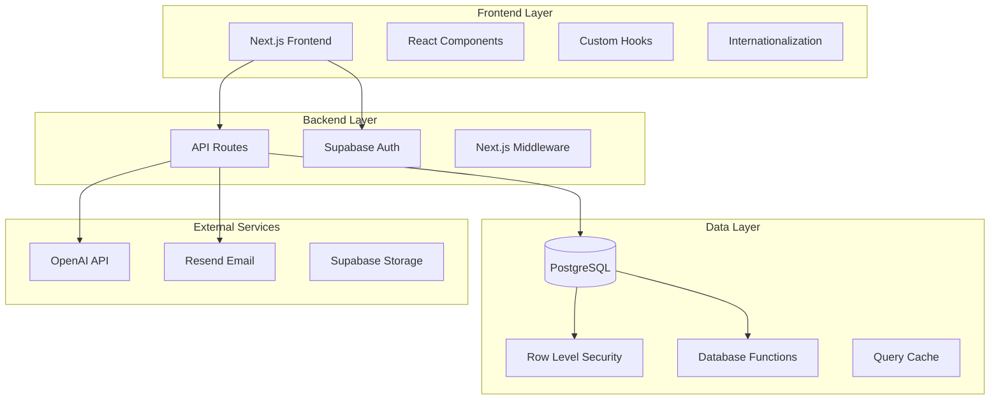
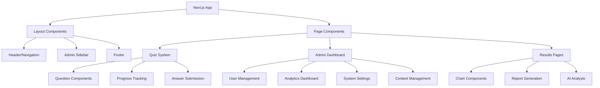
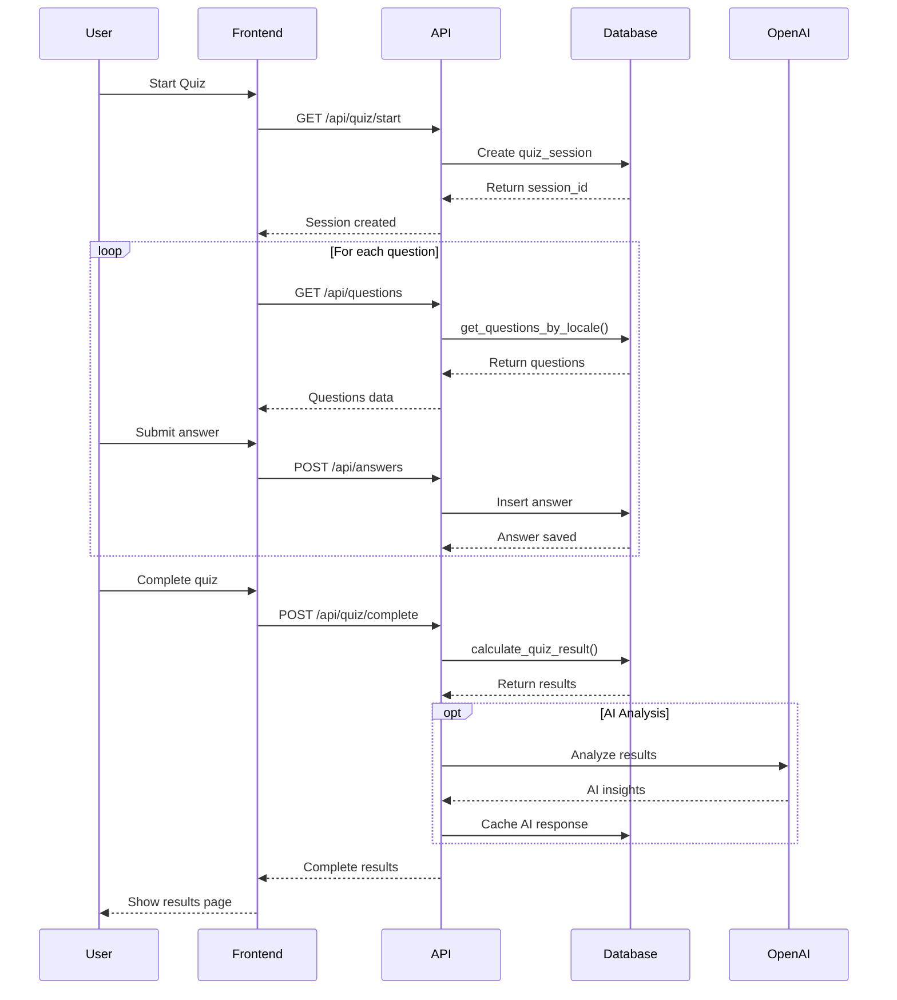
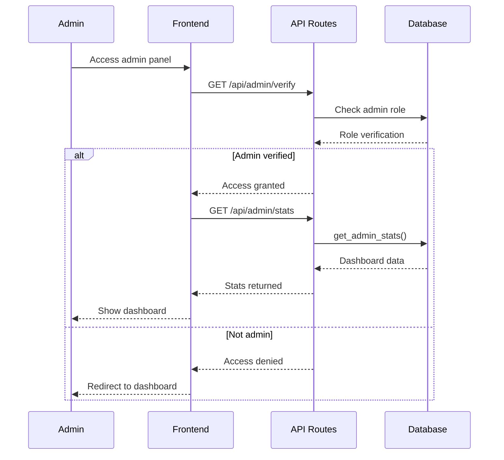
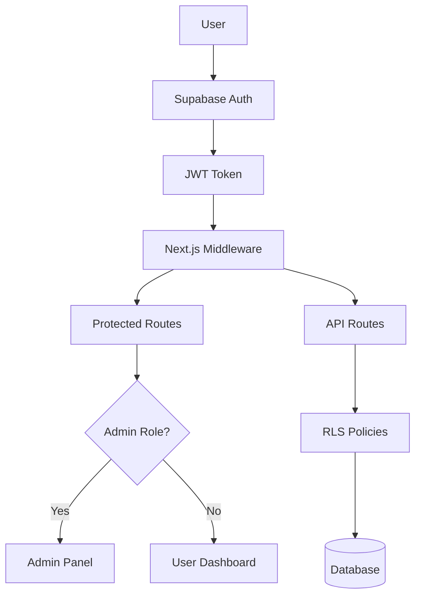
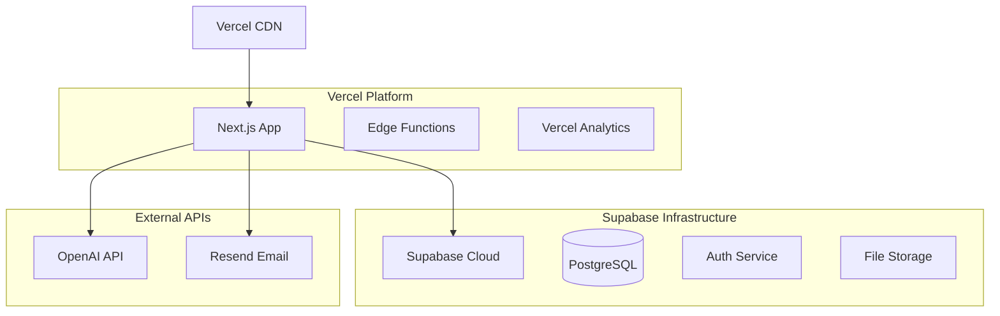
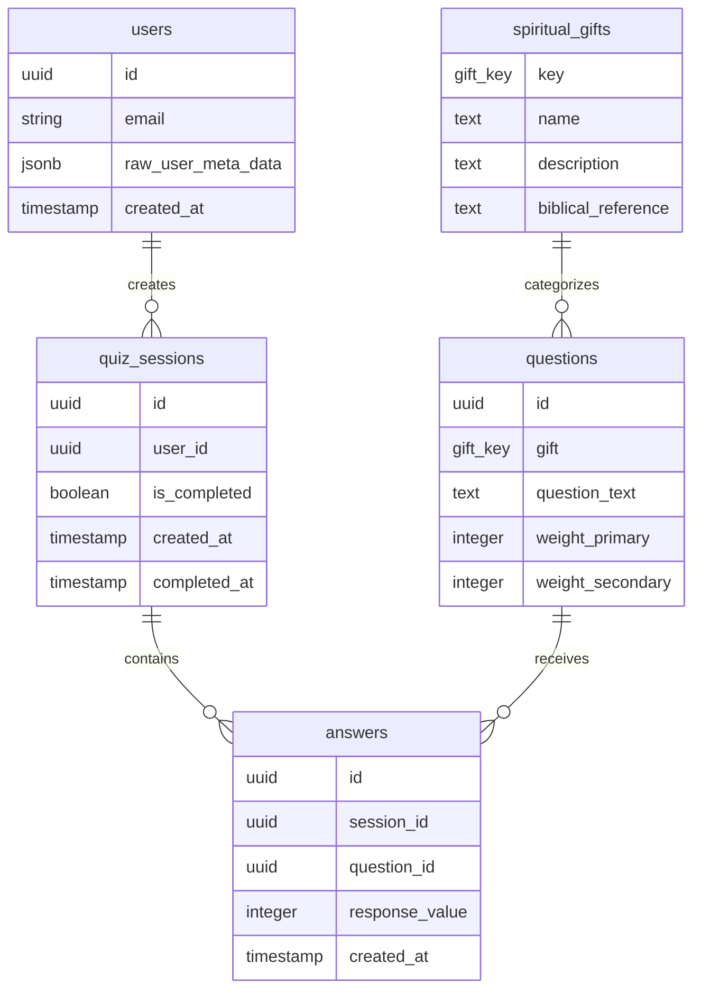

# 🏗️ Architecture Overview

This document provides a comprehensive overview of the Spiritual Gifts Test application architecture.

## 📋 Table of Contents
- [System Architecture](#system-architecture)
- [Technology Stack](#technology-stack)
- [Data Flow](#data-flow)
- [Security Model](#security-model)
- [Performance Considerations](#performance-considerations)
- [Deployment Architecture](#deployment-architecture)

## 🏗️ System Architecture

### High-Level Architecture



### Component Architecture



## 💻 Technology Stack

### Frontend Technologies

| Technology | Version | Purpose |
|------------|---------|---------|
| **Next.js** | 15.4.6 | React framework with App Router |
| **React** | 18+ | UI library |
| **TypeScript** | 5.0+ | Type safety |
| **Tailwind CSS** | 3.4+ | Utility-first CSS |
| **shadcn/ui** | Latest | Component library |
| **next-intl** | Latest | Internationalization |
| **Lucide React** | Latest | Icon library |

### Backend Technologies

| Technology | Version | Purpose |
|------------|---------|---------|
| **Supabase** | 2.0+ | Backend-as-a-Service |
| **PostgreSQL** | 15+ | Primary database |
| **Row Level Security** | Native | Data security |
| **OpenAI API** | 4.0 | AI analysis |
| **Resend** | Latest | Email service |

### Development Tools

| Tool | Purpose |
|------|---------|
| **ESLint** | Code linting |
| **Prettier** | Code formatting |
| **TypeScript** | Type checking |
| **Git** | Version control |

## 🔄 Data Flow

### Quiz Flow



### Admin Dashboard Flow



## 🔐 Security Model

### Authentication Layer



### Row Level Security (RLS)

The system implements granular access control through PostgreSQL RLS:

#### User Data Access
```sql
-- Users can only access their own quiz sessions
CREATE POLICY "Users can view own sessions" ON quiz_sessions
  FOR SELECT USING (auth.uid() = user_id);

-- Users can only insert their own answers  
CREATE POLICY "Users can insert own answers" ON answers
  FOR INSERT WITH CHECK (
    session_id IN (
      SELECT id FROM quiz_sessions WHERE user_id = auth.uid()
    )
  );
```

#### Admin Access
```sql
-- Admins can access all data
CREATE POLICY "Admins can view all data" ON quiz_sessions
  FOR ALL USING (
    EXISTS (
      SELECT 1 FROM auth.users 
      WHERE auth.users.id = auth.uid() 
      AND (auth.users.raw_user_meta_data->>'role' = 'admin')
    )
  );
```

#### Public Data
```sql
-- Everyone can read spiritual gifts data
CREATE POLICY "Public read on spiritual_gifts" ON spiritual_gifts
  FOR SELECT USING (true);
```

### API Security

- **Rate Limiting**: Implemented on critical endpoints
- **Input Validation**: Server-side validation for all inputs
- **CORS**: Properly configured for production
- **HTTPS**: Enforced in production environment

## ⚡ Performance Considerations

### Frontend Optimization

- **Code Splitting**: Automatic with Next.js App Router
- **Image Optimization**: Next.js Image component
- **Font Optimization**: Next.js Font optimization
- **Bundle Analysis**: Regular bundle size monitoring

### Database Optimization

- **Indexing Strategy**: Optimized indexes for frequent queries
- **Query Optimization**: Efficient PostgreSQL functions
- **Connection Pooling**: Supabase handles connection management
- **Caching**: Strategic caching of expensive operations

### API Performance

- **Debouncing**: Client-side debouncing for settings
- **Pagination**: Large datasets are paginated
- **Response Caching**: Cache headers for static data
- **Compression**: Gzip compression enabled

## 🚀 Deployment Architecture

### Production Environment



### Environment Configuration

| Environment | Purpose | URL Pattern |
|-------------|---------|-------------|
| **Development** | Local development | `localhost:3000` |
| **Preview** | Feature testing | `*.vercel.app` |
| **Production** | Live application | `yourdomain.com` |

### Database Environments

- **Development**: Local Supabase or shared dev instance
- **Staging**: Separate Supabase project for testing
- **Production**: Production Supabase project with backups

## 📊 Monitoring and Observability

### Application Monitoring

- **Error Tracking**: Next.js error boundaries
- **Performance Monitoring**: Web Vitals tracking
- **User Analytics**: Privacy-compliant usage tracking

### Database Monitoring

- **Query Performance**: Supabase dashboard metrics
- **Connection Monitoring**: Connection pool analysis
- **Storage Usage**: Database size and growth tracking

### External Service Monitoring

- **API Response Times**: External service latency
- **Error Rates**: Failed API calls tracking
- **Usage Quotas**: OpenAI and Resend usage monitoring

## 🔄 Data Architecture

### Database Schema Overview



## 🧪 Testing Strategy

### Frontend Testing

- **Unit Tests**: Component testing with Jest/React Testing Library
- **Integration Tests**: API integration testing
- **E2E Tests**: Critical user flows with Playwright/Cypress

### Backend Testing

- **Database Tests**: PostgreSQL function testing
- **API Tests**: Endpoint testing with automated requests
- **Security Tests**: RLS policy validation

### Performance Testing

- **Load Testing**: Concurrent user simulation
- **Stress Testing**: System limits identification
- **Database Performance**: Query optimization validation

---

## 📚 Related Documentation

- [Database Schema](database.md) - Detailed database structure
- [API Documentation](api.md) - Complete API reference
- [Security Policies](security.md) - Security implementation details
- [Development Setup](../setup/development.md) - Local development guide

---

> This architecture is designed to be scalable, secure, and maintainable while providing excellent performance for users worldwide.